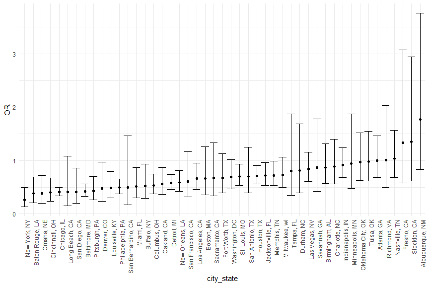
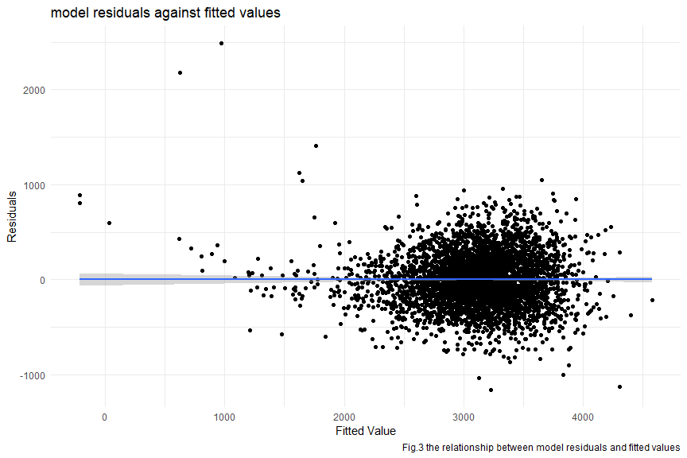
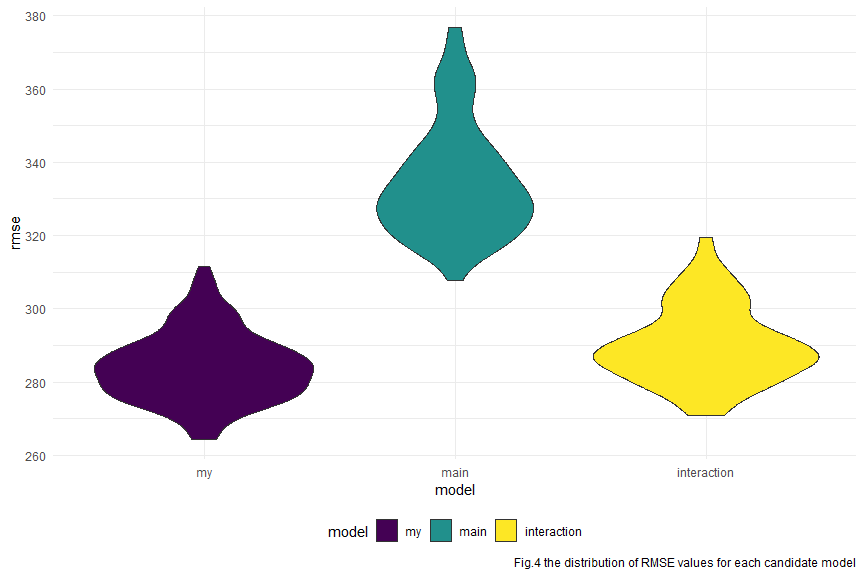

p8105_hw6_ps3395
================
Peng Su
2023-12-01

# Problem 1

In the data cleaning code below we create a `city_state` variable,
change `victim_age` to numeric, modifiy victim_race to have categories
white and non-white, with white as the reference category, and create a
`resolution` variable indicating whether the homicide is solved. Lastly,
we filtered out the following cities: Tulsa, AL; Dallas, TX; Phoenix,
AZ; and Kansas City, MO; and we retained only the variables
`city_state`, `resolution`, `victim_age`, `victim_sex`, and
`victim_race`.

``` r
homicide_df = 
  read_csv("data/homicide-data.csv", na = c("", "NA", "Unknown")) |> 
  mutate(
    city_state = str_c(city, state, sep = ", "),
    victim_age = as.numeric(victim_age),
    resolution = case_when(
      disposition == "Closed without arrest" ~ 0,
      disposition == "Open/No arrest"        ~ 0,
      disposition == "Closed by arrest"      ~ 1)
  ) |> 
  filter(victim_race %in% c("White", "Black")) |> 
  filter(!(city_state %in% c("Tulsa, AL", "Dallas, TX", "Phoenix, AZ", "Kansas City, MO"))) |> 
  select(city_state, resolution, victim_age, victim_sex, victim_race)
```

Next we fit a logistic regression model using only data from Baltimore,
MD. We model `resolved` as the outcome and `victim_age`, `victim_sex`,
and `victim_race` as predictors. We save the output as `baltimore_glm`
so that we can apply `broom::tidy` to this object and obtain the
estimate and confidence interval of the adjusted odds ratio for solving
homicides comparing non-white victims to white victims.

``` r
baltimore_glm = 
  filter(homicide_df, city_state == "Baltimore, MD") |> 
  glm(resolution ~ victim_age + victim_sex + victim_race, family = binomial(), data = _)

baltimore_glm |> 
  broom::tidy() |> 
  mutate(
    OR = exp(estimate), 
    OR_CI_upper = exp(estimate + 1.96 * std.error),
    OR_CI_lower = exp(estimate - 1.96 * std.error)) |> 
  filter(term == "victim_sexMale") |> 
  select(OR, OR_CI_lower, OR_CI_upper) |>
  knitr::kable(digits = 3)
```

|    OR | OR_CI_lower | OR_CI_upper |
|------:|------------:|------------:|
| 0.426 |       0.325 |       0.558 |

Below, by incorporating `nest()`, `map()`, and `unnest()` into the
preceding Baltimore-specific code, we fit a model for each of the
cities, and extract the adjusted odds ratio (and CI) for solving
homicides comparing non-white victims to white victims. We show the
first 5 rows of the resulting dataframe of model results.

``` r
model_results = 
  homicide_df |> 
  nest(data = -city_state) |> 
  mutate(
    models = map(data, \(df) glm(resolution ~ victim_age + victim_sex + victim_race, 
                             family = binomial(), data = df)),
    tidy_models = map(models, broom::tidy)) |> 
  select(-models, -data) |> 
  unnest(cols = tidy_models) |> 
  mutate(
    OR = exp(estimate), 
    OR_CI_upper = exp(estimate + 1.96 * std.error),
    OR_CI_lower = exp(estimate - 1.96 * std.error)) |> 
  filter(term == "victim_sexMale") |> 
  select(city_state, OR, OR_CI_lower, OR_CI_upper)

model_results |>
  slice(1:5) |> 
  knitr::kable(digits = 3)
```

| city_state      |    OR | OR_CI_lower | OR_CI_upper |
|:----------------|------:|------------:|------------:|
| Albuquerque, NM | 1.767 |       0.831 |       3.761 |
| Atlanta, GA     | 1.000 |       0.684 |       1.463 |
| Baltimore, MD   | 0.426 |       0.325 |       0.558 |
| Baton Rouge, LA | 0.381 |       0.209 |       0.695 |
| Birmingham, AL  | 0.870 |       0.574 |       1.318 |

Below we generate a plot of the estimated ORs and CIs for each city,
ordered by magnitude of the OR from smallest to largest. From this plot
we see that most cities have odds ratios that are smaller than 1,
suggesting that crimes with male victims have smaller odds of resolution
compared to crimes with female victims after adjusting for victim age
and race. This disparity is strongest in New yrok. In roughly half of
these cities, confidence intervals are narrow and do not contain 1,
suggesting a significant difference in resolution rates by sex after
adjustment for victim age and race.

``` r
model_results |> 
  mutate(city_state = fct_reorder(city_state, OR)) |> 
  ggplot(aes(x = city_state, y = OR)) + 
  geom_point() + 
  geom_errorbar(aes(ymin = OR_CI_lower, ymax = OR_CI_upper)) + 
  theme(axis.text.x = element_text(angle = 90, hjust = 1))
```



# Problem 2

### Download the weather data

``` r
weather_df = 
  rnoaa::meteo_pull_monitors(
    c("USW00094728"),
    var = c("PRCP", "TMIN", "TMAX"), 
    date_min = "2022-01-01",
    date_max = "2022-12-31") |>
  mutate(
    name = recode(id, USW00094728 = "CentralPark_NY"),
    tmin = tmin / 10,
    tmax = tmax / 10) |>
  select(name, id, everything())
```

### 5000 bootstrap samples and fit each sample with linear regression model, then plot the distribution of the r squared and log(beta_1 \* beta_2).

``` r
set.seed(12138)

#bootstrap of linear model
weather_df_bootstrap = 
  weather_df |>  
  modelr::bootstrap(n = 5000) |> 
  mutate(
    models = map(strap, \(df) lm(tmax ~ tmin + prcp, data = df)),
    results_r2 = map(models, broom::glance),
    results_beta = map(models, broom::tidy)) |> 
  select(results_beta, results_r2) |> 
  unnest(results_beta, results_r2) |>
  select(term, estimate, r.squared) |>
  pivot_wider(names_from = term, values_from = estimate) |>
  mutate(
    beta_0 = `(Intercept)`,
    beta_1 = tmin,
    beta_2 = prcp,
    log_beta = log(beta_1 * beta_2)
  ) |>
  select(log_beta, r.squared) |>
  drop_na()

#distribution of r2 

weather_df_bootstrap |>
  select(r.squared) |>
  ggplot(aes(x = r.squared)) + 
  geom_density() + 
  labs(
    title = "Distribution of R-squared",
    x = "Estimated R Squared",
    y = "Density",
    caption = "Fig.1 The distribution of estimated R-sequare from 5000 bootstrap samples"
  )
```


``` r
#distribution of log_beta 

weather_df_bootstrap |>
  select(log_beta) |>
  ggplot(aes(x = log_beta)) + 
  geom_density() + 
  labs(
    title = "Distribution of log_beta",
    x = "Estimated log_beta",
    y = "Density",
    caption = "Fig.2 The distribution of estimated log(beta_1 * beta_2) from 5000 bootstrap samples"
  )
```


From Fig.1 it is noticeable that the distribution of $\hat{r}^{2}$ is
approximates the normal distribution and is approximately symmetric
about 0.91. At the same time, this represents that majority of bootstrap
samples’ estimated r squared is centered around 0.91.

In addition, Fig.2 shows the distribution of
$log(\hat{\beta _{1}}\times\hat{\beta _{2}})$ which is a left-skewed
bell shape plot and reach its peak around -5.5.

### identify the 2.5% and 97.5% quantiles to provide a 95% confidence interval for r squared and log(beta_1 \* beta_2).

``` r
#CI of r squared
weather_df_bootstrap |>
  select(r.squared) |> 
  summarize(
    lower_CI = quantile(r.squared, 0.025),
    upper_CI = quantile(r.squared, 0.975)
  ) |>
  knitr::kable(caption = "Table 1, the 95% confidence interval for r squared")
```

|  lower_CI |  upper_CI |
|----------:|----------:|
| 0.8823246 | 0.9269894 |

Table 1, the 95% confidence interval for r squared

``` r
#CI of log_beta
weather_df_bootstrap |>
  select(log_beta) |> 
  summarize(
    lower_CI = quantile(log_beta, 0.025),
    upper_CI = quantile(log_beta, 0.975)
  ) |>
  knitr::kable(caption = "Table 2, the 95% confidence interval for log_beta")
```

|  lower_CI | upper_CI |
|----------:|---------:|
| -8.931648 | -4.54395 |

Table 2, the 95% confidence interval for log_beta

Two tables above identified the 95% confidence interval for
$\hat{r}^{2}$ and $log(\hat{\beta _{1}}\times\hat{\beta _{2}})$.

# Problem 3

### Load and clean the data for regression analysis

``` r
#load and tidy the data
birthweight_df = 
  read_csv("./data/birthweight.csv") |>
  janitor::clean_names() |>
  mutate(
    babysex = as.factor(babysex),
    frace = as.factor(frace),
    malform = as.factor(malform),
    mrace = as.factor(mrace)
  ) |>
  drop_na()
```

### Propose a regression model for birthweight. This model may be based on a hypothesized structure for the factors that underly birthweight, on a data-driven model-building process, or a combination of the two.

Based on the data set, from my point of view, the birthweights of babies
may be affected by babies’ body types, gestational age in weeks, health
conditions, as well as the physical condition and behavior of the
mothers. In this case, I’ve chosen the variables `bhead`, `blength`,
`gaweeks`, `malform`, `mheight`, `momage`, `ppbmi`, `ppwt`, `smoken` as
predictor to predict birth weight, and fit the data to a multiple linear
regression model.

``` r
# fit MLR 
birthweight_MLR = 
  birthweight_df |>
  lm(bwt ~ bhead + blength + gaweeks + 
                       malform + mheight + momage + 
                       ppbmi + ppwt + smoken, data = _)
birthweight_MLR |>
  broom::tidy() |>
  knitr::kable()
```

| term        |      estimate |   std.error |   statistic |   p.value |
|:------------|--------------:|------------:|------------:|----------:|
| (Intercept) | -7027.2719134 | 679.2498065 | -10.3456370 | 0.0000000 |
| bhead       |   136.3188591 |   3.5032662 |  38.9119324 | 0.0000000 |
| blength     |    79.1366109 |   2.0776128 |  38.0901630 | 0.0000000 |
| gaweeks     |    14.5592512 |   1.4988496 |   9.7136170 | 0.0000000 |
| malform1    |    46.6396106 |  73.1960741 |   0.6371873 | 0.5240365 |
| mheight     |    13.4991815 |  10.6432023 |   1.2683383 | 0.2047453 |
| momage      |     5.0185080 |   1.1289756 |   4.4451872 | 0.0000090 |
| ppbmi       |     4.5178265 |  15.4007597 |   0.2933509 | 0.7692680 |
| ppwt        |    -0.0251382 |   2.6730841 |  -0.0094042 | 0.9924971 |
| smoken      |    -2.4517367 |   0.5855185 |  -4.1872918 | 0.0000288 |

### plot of model residuals against fitted values

``` r
#plot of model residuals against fitted values
birthweight_df |>
  add_predictions(birthweight_MLR) |>
  add_residuals(birthweight_MLR) |>
  ggplot(aes(x = pred, y = resid)) +
  geom_point() +
  geom_smooth(method = "lm") +
  labs(
    title = "model residuals against fitted values ", 
    x = ("Fitted Value"),
    y = ("Residuals"),
    caption = "Fig.3 the relationship between model residuals and fitted values")
```



It can be seen from Fig.3 that the smooth curve fitted according to the
residuals and fitted data is approximately a straight line with
residuals equal to 0, and most of the residuals are uniformly and
randomly distributed on both sides of the fitted curve, which may
indicate that this MLR model is relatively reasonable.

### Compare your model to two others

``` r
# creating training and testing data
cv_df = 
  crossv_mc(birthweight_df, 100) 

#fit data to three models and compare RMSE
cv_df = 
  cv_df |> 
  mutate(
    my_mod  = map(train, \(df) lm(bwt ~ bhead + blength + gaweeks + 
                       malform + mheight + momage + 
                       ppbmi + ppwt + smoken, data = df)),
    main_mod  = map(train, \(df) lm(bwt ~ blength + gaweeks, data = df)),
    interaction_mod  = map(train, \(df) lm(bwt ~ bhead*blength*babysex, data = df))) |>
  
  mutate(
    rmse_my = map2_dbl(my_mod, test, \(mod, df) rmse(model = mod, data = df)),
    rmse_main = map2_dbl(main_mod, test, \(mod, df) rmse(model = mod, data = df)),
    rmse_interaction = map2_dbl(interaction_mod, test, \(mod, df) rmse(model = mod, data = df)))

#shows the distribution of RMSE values for each candidate model
cv_df |> 
  select(starts_with("rmse")) |> 
  pivot_longer(
    everything(),
    names_to = "model", 
    values_to = "rmse",
    names_prefix = "rmse_") |> 
  mutate(model = fct_inorder(model)) |> 
  ggplot(aes(x = model, y = rmse)) + 
  geom_violin(aes(fill = model)) +
  labs(
    caption = "Fig.4 the distribution of RMSE values for each candidate model"
  )
```



From Fig.4, it is noticeable that my model has the lowest RMSE, which
indicates that my model fits the data better than the other two models,
while the model that only considers the main effects between length at
birth and gestational age as predictors on the birth weight has the
highest RMSE, possibly indicating that its performance is relatively
poor.
