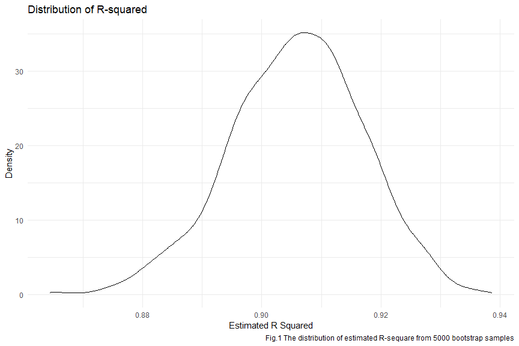
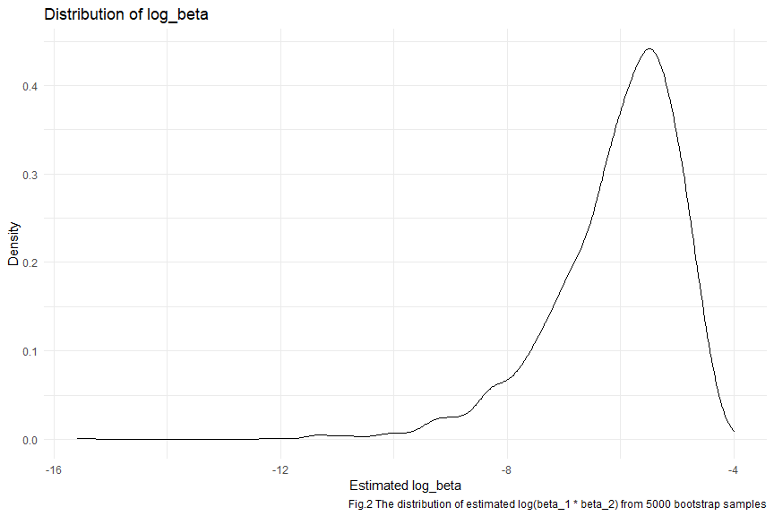

p8105_hw6_ps3395
================
Peng Su
2023-12-01

# Problem 2

### Download the weather data

``` r
weather_df = 
  rnoaa::meteo_pull_monitors(
    c("USW00094728"),
    var = c("PRCP", "TMIN", "TMAX"), 
    date_min = "2022-01-01",
    date_max = "2022-12-31") |>
  mutate(
    name = recode(id, USW00094728 = "CentralPark_NY"),
    tmin = tmin / 10,
    tmax = tmax / 10) |>
  select(name, id, everything())
```

### 5000 bootstrap samples and fit each sample with linear regression model, then plot the distribution of the r squared and log(beta_1 \* beta_2).

``` r
set.seed(12138)

#bootstrap of linear model
weather_df_bootstrap = 
  weather_df |>  
  modelr::bootstrap(n = 5000) |> 
  mutate(
    models = map(strap, \(df) lm(tmax ~ tmin + prcp, data = df)),
    results_r2 = map(models, broom::glance),
    results_beta = map(models, broom::tidy)) |> 
  select(results_beta, results_r2) |> 
  unnest(results_beta, results_r2) |>
  select(term, estimate, r.squared) |>
  pivot_wider(names_from = term, values_from = estimate) |>
  mutate(
    beta_0 = `(Intercept)`,
    beta_1 = tmin,
    beta_2 = prcp,
    log_beta = log(beta_1 * beta_2)
  ) |>
  select(log_beta, r.squared) |>
  drop_na()

#distribution of r2 

weather_df_bootstrap |>
  select(r.squared) |>
  ggplot(aes(x = r.squared)) + 
  geom_density() + 
  labs(
    title = "Distribution of R-squared",
    x = "Estimated R Squared",
    y = "Density",
    caption = "Fig.1 The distribution of estimated R-sequare from 5000 bootstrap samples"
  )
```



``` r
#distribution of log_beta 

weather_df_bootstrap |>
  select(log_beta) |>
  ggplot(aes(x = log_beta)) + 
  geom_density() + 
  labs(
    title = "Distribution of log_beta",
    x = "Estimated log_beta",
    y = "Density",
    caption = "Fig.2 The distribution of estimated log(beta_1 * beta_2) from 5000 bootstrap samples"
  )
```



From Fig.1 it is noticeable that the distribution of $\hat{r}^{2}$ is
approximates the normal distribution and is approximately symmetric
about 0.91. At the same time, this represents that majority of bootstrap
samples’ estimated r squared is centered around 0.91.

In addition, Fig.2 shows the distribution of
$log(\hat{\beta _{1}}\times\hat{\beta _{2}})$ which is a left-skewed
bell shape plot and reach its peak around -5.5.

### identify the 2.5% and 97.5% quantiles to provide a 95% confidence interval for r squared and log(beta_1 \* beta_2).

``` r
#CI of r squared
weather_df_bootstrap |>
  select(r.squared) |> 
  summarize(
    lower_CI = quantile(r.squared, 0.025),
    upper_CI = quantile(r.squared, 0.975)
  ) |>
  knitr::kable(caption = "the 95% confidence interval for r squared")
```

|  lower_CI |  upper_CI |
|----------:|----------:|
| 0.8823246 | 0.9269894 |

the 95% confidence interval for r squared

``` r
#CI of log_beta
weather_df_bootstrap |>
  select(log_beta) |> 
  summarize(
    lower_CI = quantile(log_beta, 0.025),
    upper_CI = quantile(log_beta, 0.975)
  ) |>
  knitr::kable(caption = "the 95% confidence interval for log_beta")
```

|  lower_CI | upper_CI |
|----------:|---------:|
| -8.931648 | -4.54395 |

the 95% confidence interval for log_beta

Two tables above identified the 95% confidence interval for
$\hat{r}^{2}$ and $log(\hat{\beta _{1}}\times\hat{\beta _{2}})$.
